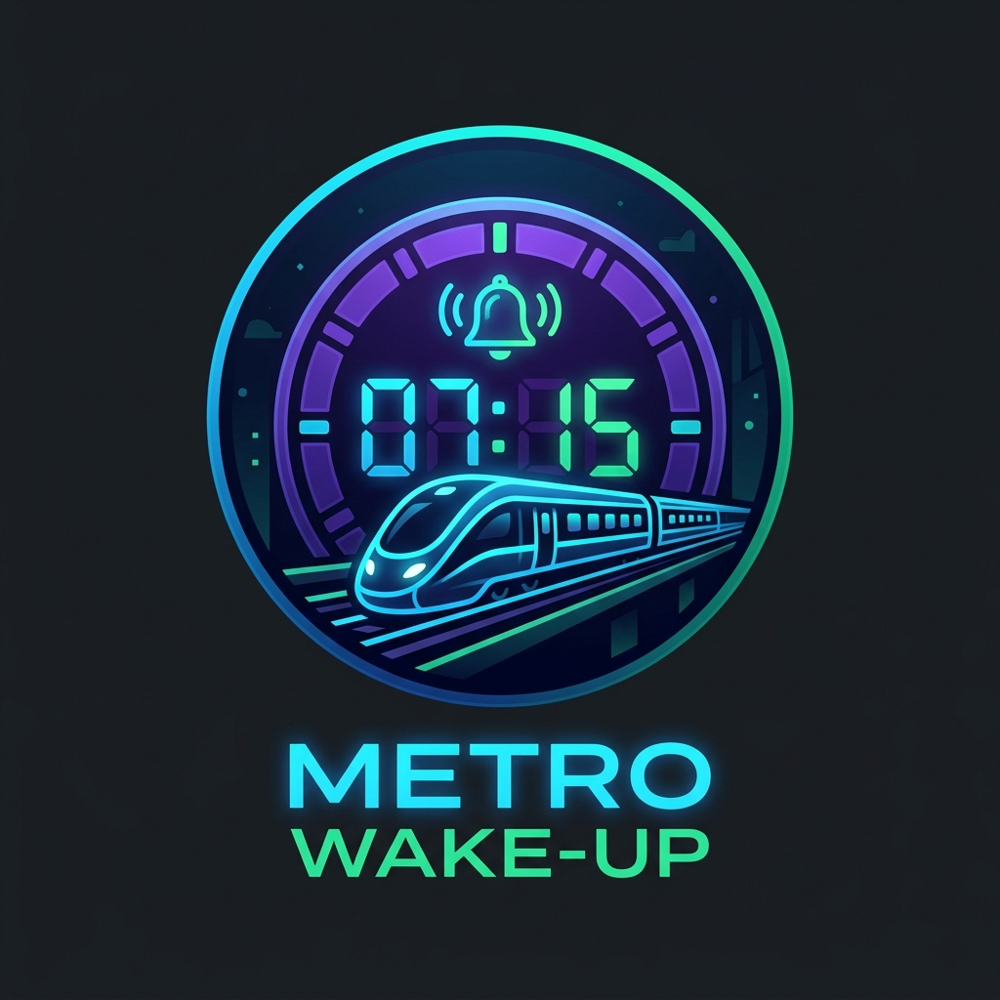
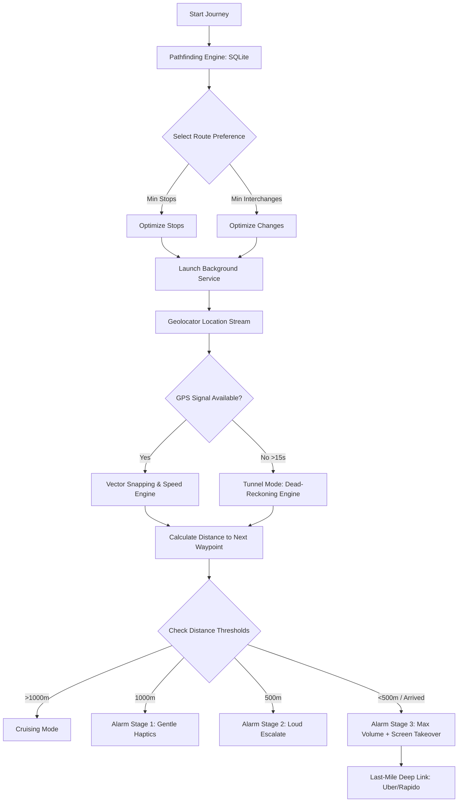

<p align="center">
  
</p>

# 🚇 Metro Wake-Up: Hyderabad Metro Offline-First Journey Assistant


[](https://flutter.dev)
[](https://dart.dev)
[](https://sqlite.org)
[](https://opensource.org/licenses/MIT)
[](#)

A production-grade, privacy-first **offline-first** travel companion application designed specifically for the **Hyderabad Metro** network. The application ensures commuters never miss their transfer stations or final destinations by triggering multi-stage, adaptive alarms entirely on-device, even when traveling underground without network connectivity.

---

## 📷 Screenshots / Application UI
*(Add your screenshots here to show off the premium design aesthetics!)*

| 📱 Home Screen | 🚇 Route Selection | 📍 Live Journey Tracking | 🚨 Alarm Takeover Screen |
| :---: | :---: | :---: | :---: |
|  |  |  |  |

---

## 📖 The Problem & The Solution

**The Problem:** Metro commutes in major hubs like Hyderabad are often long. Commuters frequently fall asleep, read, or listen to music, leading them to miss critical transfers (like JBS Parade Ground or Ameerpet) or their final destination (like Raidurg). Furthermore, underground tunnels cut off internet access, rendering web-based navigation applications (like Google Maps) completely useless inside metro tunnels.

**The Solution:** **Metro Wake-Up** uses a localized SQLite database, satellite-based GPS streams, vector snapping calculations, and dead-reckoning algorithms to track passenger journeys completely offline. It runs as a resilient background service and raises progressive, high-priority alarms to wake the commuter up at the exact right moment.

---

## 🌟 Key Features

### 1. 🛠️ Offline Route Planning & Optimization
*   **Pathfinding Engine**: Implements on-device pathfinding using a local SQLite database of the Hyderabad Metro network.
*   **Commute Preferences**: Allows users to filter route choices based on:
    *   *Minimum Stops*: Gets the commuter to the destination in the fewest stops possible.
    *   *Minimum Interchanges*: Minimizes the need to physically change platforms/lines.
*   **Automatic Source Detection**: Dynamically detects the nearest metro station to the user and suggests it as the starting point.

### 2. 🛰️ Privacy-First Offline Tracking
*   **Zero Server Communication**: Coordinates are never sent to external APIs or servers.
*   **Vector Snapping (`_snapToRoute`)**: Instead of relying on raw GPS pings (which can drift inside stations), the tracking logic projects and snaps the user's location coordinates directly onto the defined metro track coordinates.

### 3. 🚇 Underground Dead-Reckoning (Tunnel Mode)
*   Metro lines run underground in several sections where GPS signals drop completely.
*   To solve this, the application monitors speed trends using a custom **Speed Engine**. When a GPS drop is detected (>15 seconds), it automatically falls back to **Dead-Reckoning**—advancing the simulated route progress based on last-known speed and time, ensuring safety notifications still fire.

### 4. 🚨 Adaptive Multi-Stage Alarms
Integrates a hardware-level `AlarmService` mapped to route milestones:
*   **Stage 1: Gentle Reminder** (Station before target/1000m out): Soft audio track playing on loop with light haptic pulses.
*   **Stage 2: Escalate Alert** (90 seconds / 500m out): Louder audio with increased frequency of medium haptic feedback.
*   **Stage 3: Emergency Wake-Up** (<500m or at Station): Max volume audio, heavy haptics, and system **Wakelock activation** to force the screen to turn on and render a full-screen takeover modal.

### 🚗 Last-Mile Deep Linking & Extras
*   **Ride-Booking Integration**: Offers instant, one-tap deep links to **Uber** and **Rapido** at the final destination for seamless last-mile connectivity.
*   **WhatsApp Live Status Sharing**: Formats your live travel status, ETA, and next stop into an attractive text snippet that can be shared instantly.
*   **Offline Map Fallback**: Interactive dark-themed maps fall back to custom, high-resolution vector assets (`assets/metro_map.png`) when network connectivity is lost.

---

## 📐 How it Works: Real-World Example

### Scenario: Commute from **Chikkadpally** to **Raidurg**

```
[Chikkadpally (Green)] ➔ [JBS Parade Ground (Transfer)] ➔ [Raidurg (Blue)]
```

1.  **Start Journey**: The app calculates the route offline using the local database. It identifies that you need to transfer at **JBS Parade Ground** from the Green Line to the Blue Line.
2.  **Tracking In Transit**: The app's background service initiates location pooling. It snaps the coordinates onto the Green Line.
3.  **The First Alarm (Interchange Alert)**: As the train approaches **JBS Parade Ground**, the distance drops below 1000m. The app sounds an alert: *"Board Blue Line → Raidurg"*. This tells you it's time to get up and change trains.
4.  **The Second Alarm (Destination Alert)**: You board the Blue Line. The background service switches tracking to the Blue Line leg. As you approach **Raidurg**, the final destination, a loud emergency alarm sounds to make sure you get down.

---

## ⚙️ Technical Architecture & Flow



---

## 💾 Local SQLite Database Schema

The database has four core tables to support completely offline operation:

### 1. `stations`
Stores the metadata, coordinates, and sorting sequence of all metro stations.
```sql
CREATE TABLE stations (
  id TEXT PRIMARY KEY,
  name TEXT NOT NULL,
  lat REAL NOT NULL,
  lng REAL NOT NULL,
  line TEXT NOT NULL,
  orderIndex INTEGER NOT NULL
)
```

### 2. `journeys`
Tracks historical and currently active journeys.
```sql
CREATE TABLE journeys (
  id TEXT PRIMARY KEY,
  startStationId TEXT NOT NULL,
  destinationStationId TEXT NOT NULL,
  startTime TEXT NOT NULL,
  active INTEGER NOT NULL -- Boolean (0 or 1)
)
```

### 3. `runtime_state`
Holds state cache for recovery in case the app process is restarted during a trip.
```sql
CREATE TABLE runtime_state (
  id INTEGER PRIMARY KEY AUTOINCREMENT,
  lastKnownSpeed REAL,
  currentStationId TEXT,
  mode TEXT,
  timestamp INTEGER
)
```

### 4. `favorites`
Stores the user's pinned routes for quick start.
```sql
CREATE TABLE favorites (
  id TEXT PRIMARY KEY,
  startStationId TEXT NOT NULL,
  destinationStationId TEXT NOT NULL
)
```

---

## 🧮 Mathematical & Algorithmic Explanations

### A. Graph Construction & Dijkstra's Algorithm
The `PathfindingEngine` models the metro network as a weighted graph $G = (V, E)$, where $V$ represents the metro stations and $E$ represents the tracks/transfer linkages.
*   **Edge Weights**:
    *   Moving to an adjacent station on the same line: $\text{Weight} = 1.0$
    *   Transferring lines at Ameerpet, MGBS, or Parade Ground:
        *   **Fastest Preference**: $\text{Weight} = 1.2$ (Slight penalty)
        *   **Fewest Transfers Preference**: $\text{Weight} = 50.0$ (High penalty, forcing the algorithm to find single-line paths even if they take more stops)

Here is a snippet of Dijkstra's core evaluation loop inside `pathfinding_engine.dart`:
```dart
for (String neighborId in _graph[current.id] ?? []) {
  double edgeCost = 1.0;
  Station currentStation = _allStations.firstWhere((s) => s.id == current.id);
  Station neighborStation = _allStations.firstWhere((s) => s.id == neighborId);
  
  if (currentStation.line != neighborStation.line) {
    if (pref == RoutePreference.fewestTransfers) {
      edgeCost = 50.0; // Penalty
    } else {
      edgeCost = 1.2;
    }
  }
  
  double newCost = current.cost + edgeCost;
  // Cost evaluation and relaxation...
}
```

### B. Vector Location Snapping
To keep the UI smooth and prevent GPS noise from showing the train hopping off the tracks, raw location coordinates are snapped onto the 2D segment between the current station $A$ and next station $B$.
Given:
*   $P$ as the raw GPS coordinate vector.
*   $A$ and $B$ as the coordinate vectors of the current and next station.

We find the projection factor $t$ using the vector formula:
$$t = \frac{(P - A) \cdot (B - A)}{\|B - A\|^2}$$

We clamp $t \in [0, 1]$ to keep the snapped position between the stations, and compute:
$$\text{Snapped Position} = A + t(B - A)$$

This prevents drifting and maintains visual fidelity of the route line map.

### C. Speed Signal Filtering (Haversine & Moving Average)
Raw `Position.speed` signals from mobile OS APIs are highly prone to spikes. The custom `SpeedEngine` processes tracking data as follows:
1.  **Distance Calculation (Haversine Formula)**:
    $$d = 2R \arcsin\left(\sqrt{\sin^2\left(\frac{\Delta \text{lat}}{2}\right) + \cos(\text{lat}_1)\cos(\text{lat}_2)\sin^2\left(\frac{\Delta \text{lon}}{2}\right)}\right)$$
2.  **Drift Rejection**: Ignores differences under 5 meters.
3.  **Spike Clamping**: Rejects speeds $> 120\text{ km/h}$.
4.  **Smoothing Buffer**: Uses a 5-point rolling average window:
    $$\text{Smoothed Speed} = \frac{1}{N} \sum_{i=1}^{N} \text{Speed}_i$$
5.  **Stationary Detection**: If speed remains below $3\text{ km/h}$ for $10\text{ seconds}$, it triggers stationary status to prevent alarm drift at platform stops.

---

## 🛠️ Tech Stack & Dependencies

*   **Core Framework**: [Flutter & Dart](https://flutter.dev)
*   **Local Storage**: `sqflite` (relational database caching for lines/stations) & `shared_preferences` (user configurations).
*   **Background Processing**: `flutter_background_service` (operates as a native Android Foreground Service to prevent background termination by OS).
*   **Location & Sensors**: `geolocator` (accesses high-accuracy GPS streams).
*   **Multimedia & Haptics**: `audioplayers` (custom audio streams) and native `HapticFeedback` wrappers.
*   **Mapping**: `flutter_map` (Leaflet-based tile layer rendering) with tile caching.
*   **Utilities**: `wakelock_plus` (keeps CPU and screen active for Stage 3 takeover) & `url_launcher` (rideshare deep-linking).

---

## 📁 Key Modules & Code Structure

The project code is organized as follows:
```text
lib/
├── data/
│   └── database_helper.dart      # Database initialization, bootstrapping, favorites CRUD
├── models/
│   ├── journey.dart             # Model schema for active journeys
│   ├── route_option.dart        # Route metrics (stops, transfers, sequence)
│   └── station.dart             # Metro station entity schema
├── screens/
│   ├── home_screen.dart         # Main conversational portal UI
│   ├── live_journey_screen.dart # Interactive map, live statistics, alarm takeover layer
│   └── route_selection_screen.dart # Displays options, transfers, and stops overview
└── services/
    ├── alarm_service.dart       # Coordinates volume escalation, loops audio, triggers haptics
    ├── background_service.dart  # Manages background isolate orchestration
    ├── location_tracker.dart    # Heart of the background tracking & tunnel reckoning
    ├── pathfinding_engine.dart  # Dijkstra path-generation algorithm
    └── speed_engine.dart        # Noise rejection and speed smoothing engine
```

---

## 🚀 Getting Started & Installation

### Prerequisites
*   Flutter SDK (v3.0.0 or higher)
*   Android Studio / Xcode
*   A physical device (recommended for testing GPS and background services)

### Setup Instructions
1.  **Clone the Repository**
    ```bash
    git clone https://github.com/yourusername/metro_remainder.git
    cd metro_remainder
    ```

2.  **Install Dependencies**
    ```bash
    flutter pub get
    ```

3.  **Provide Assets**
    Ensure custom alarm sound bites (`alarm1.mp3`, `alarm2.mp3`, `alarm3.mp3`) and the offline map fallback image (`assets/metro_map.png`) exist in their respective directories.

4.  **Configure Permissions**
    *   **Android**:
        Ensure permissions are configured in `android/app/src/main/AndroidManifest.xml`:
        ```xml
        <uses-permission android:name="android.permission.ACCESS_FINE_LOCATION" />
        <uses-permission android:name="android.permission.ACCESS_COARSE_LOCATION" />
        <uses-permission android:name="android.permission.FOREGROUND_SERVICE" />
        <uses-permission android:name="android.permission.FOREGROUND_SERVICE_LOCATION" />
        <uses-permission android:name="android.permission.WAKE_LOCK" />
        ```
    *   **iOS**:
        Add to `ios/Runner/Info.plist`:
        ```xml
        <key>NSLocationWhenInUseUsageDescription</key>
        <string>Metro Wake-Up needs location access to track progress along the route.</string>
        <key>NSLocationAlwaysAndWhenInUseUsageDescription</key>
        <string>Metro Wake-Up needs background location access to trigger wake-up alarms.</string>
        <key>UIBackgroundModes</key>
        <array>
            <string>location</string>
        </array>
        ```

5.  **Run the App**
    *   **Debug Mode**:
        ```bash
        flutter run
        ```
    *   **Release Mode** (Recommended for background tracking testing):
        ```bash
        flutter run --release
        ```

---

## 🤝 Contributing

Contributions are what make the open source community such an amazing place to learn, inspire, and create. Any contributions you make are **greatly appreciated**.

1. Fork the Project
2. Create your Feature Branch (`git checkout -b feature/AmazingFeature`)
3. Commit your Changes (`git commit -m 'Add some AmazingFeature'`)
4. Push to the Branch (`git push origin feature/AmazingFeature`)
5. Open a Pull Request

---

## 📝 License

This project is licensed under the MIT License - see the [LICENSE](LICENSE) file for details.

---

## 📧 Contact & Support

*   **Author**: Kanamarlapudi Jaswanth
*   **Email**: [jaswanth5464@gmail.com](mailto:jaswanth5464@gmail.com)
*   **GitHub Profile**: [@Jaswanth5464](https://github.com/Jaswanth5464)
*   **Project Link**: [https://github.com/Jaswanth5464/metro_remainder](https://github.com/Jaswanth5464/metro_remainder)

*Feel free to star this repository if it helped you sleep soundly on your Hyderabad Metro commute!* ⭐

